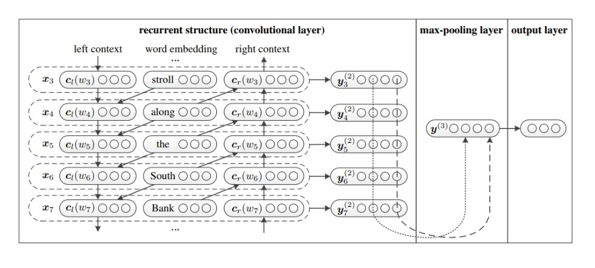

# Covid-19 Tweet Analysis

## Abstract
Covid19, since its inception, has had a huge impact on people's life. Since different governments have announced lock-down to confine the people at home to mitigate the spread of disease, people have turned to social media to express their concerns and their feelings about the situation. An insight into the mindset of the people is an invaluable commodity at dire times such as these. Analysis of this frail yet testing phase can give helpful and important insights in to the situation which would surely lead to better and informed decisions at higher levels to curb and contain not only the deadly disease but the rising panic and frustration. 
In this project, sentiment analysis is done on Covid19 related tweets from different parts of the world which is essentially a test classification problem. Recurrent convolution neural network (RCNN) is employed which uses a recurrent structure to capture more contextual information. This also uses a max-pooling layer to determine which words have more weight while describing sentiment of a tweet.

## Dataset
We  have  used  Covid19  UCD  Challenge  dataset.   Thisdataset can be categorized into 5 emotion classed namelyanaltical, fear, confident, anger and sadness.
#### Link: https://github.com/xxz-jessica/COVID-19_UCD_Challenge

## Proposed Solution
The first step is to clean up the raw text data.  In tweets,several stop words needs to be removed e.g.  prepositions,mentions,  hashtags,  URLs,  etc.   After a cleanup,  the dataneeds  to  be  converted  in  vector  form  to  feed  to  a  DeepNeural Network.  For the word2vec conversion, skip grammodel  is  used.   This  model  learns  the  vector  representa-tion from the raw data using the similarity between severalwords  based  in  their  context.   The  objective  of  the  Skip-gram model is to learn word representations that are usefulfor predicting the nearby words in a document.  Formally,given a sequence of training words/sentencew1,w2,w3,... ,wT, the objective of the Skip-gram model is to maximizethe average log probability.

After the conversion of words to usable representation,the next step is to feed it to a classifier. RNN and LSTM are commonly used to extract the global information fromthe data.  RCNN on the other hand, maintains the local in-formation which signifies the prominent features within thelimited  context  of  the  document. In this way, an overallresponse  can  be  pooled  at  the  end  which  can  better  helpduring the classifications. In this model, we use a recurrentarchitecture, which is a bidirectional recurrent network, tocapture the contexts. The recurrent structure can obtain allclin a forward scan of the text andcrin a backward scan of the text. After we obtain the representation of the word, we apply a linear transformation together with the tanh activation function and send the result to the next layer. Max-pooling is applied to these which extracts the dominant features which are then passed to FC layers to classify the tweets into emotion.

 

## Experiment setup
   - Batch Size: 64
   - Embedding layer size: 100
   - Dropout: 0.41
   - Learning rate: 0.005
   - Loss: Weighted cross entropy and Focal loss
   - Optimizer: SGD
   
### Experiments
  - Experiment 1: Sentiment140 Dataset
        Performed on LSTM and RCNN
        - With stop words
        - Without stop words

  - Experiment 2: Covid UCD Challenge
        Performed on LSTM and RCNN
        - With stop words
        - Without stop words
        
  - Experiment 3: Training model on Covid-19 UCD data using Focal Loss
  - Experiment 4: Training model on Covid-19 UCD data using Weighted Cross Entropy and Focal Loss to handle imbalance data.
  - Experiment 5: Training on Best performing model.
  
## Results
   
 #### Performance Metrics 
 

  

   
   
 #### Confusion Matrix 
 

   
   

